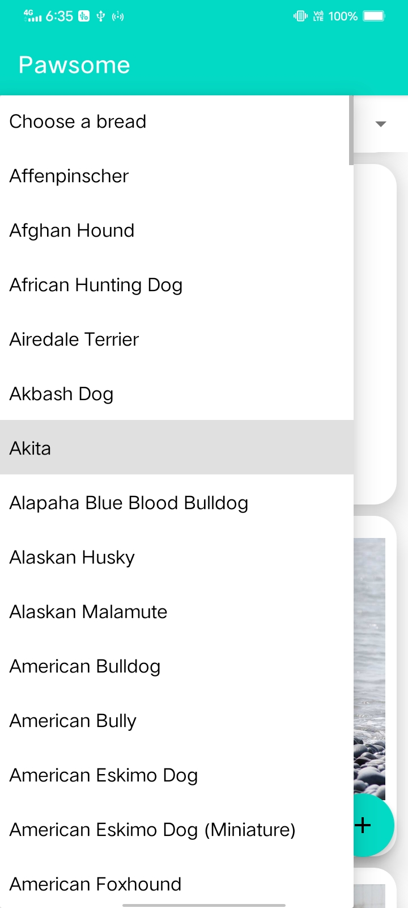

# Pawsome
Rahul is a huge dog lover and his birthday is right around the corner. His friend Mario decides to make an app- Pawsome, to surprise him. He decides to make it all about dogs, so that in spite of being at home, he can still look at different types of dogs and know more about them. While doing his research, he finds out about https://thedogapi.com/ and decides to use the API to fetch details, for his app. Help him complete it so his surprise is ready on time.
# Tech and Tools
- Developed on android studio in java.
- Learnt and implemented various topics of android such as recyclerview,getting and posting data form api using retofit,using Glide to load images.
# Features
- Users can view images of differrent dogs in the recyclerview and can get info about them on clicking the card.
- Search for dogs by dog breed.
- Upvote for your favourite dogs.
- Upload Your own dog image into the api which will come live once approved.
- Get Analysis of your uploaded images(fetched from same api).

## Screenshots
||||
| :--------: | :-----------: | :-------: |
||||
||||
